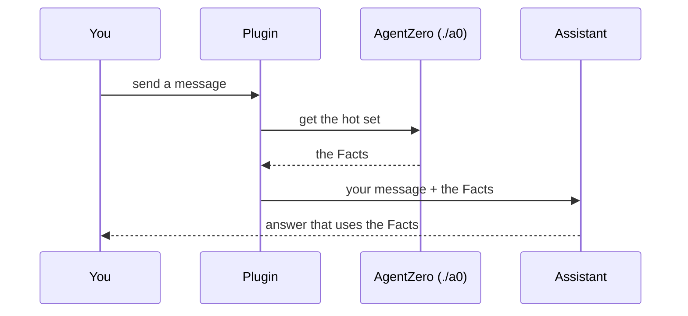
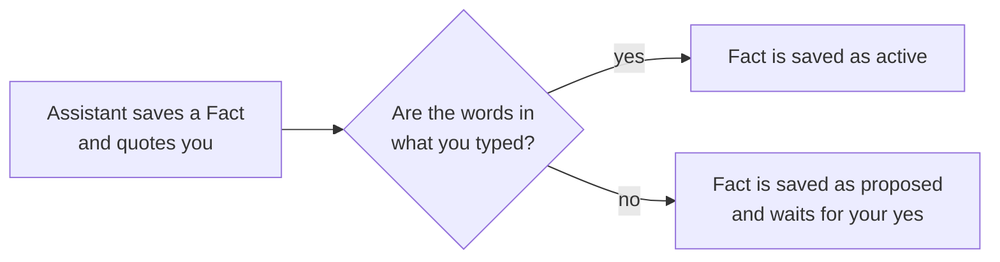

# agentzero-claude-mod

**English** | [简体中文](./README.zh-CN.md)

A plugin for Claude Code. It gives the AI assistant a memory for your project. It also checks that the memory is correct.

## The problem

Claude Code forgets. When you start a new conversation, the assistant does not know what you said last week.

[AgentZero](https://github.com/jesselei1102-hue/agentzero) is a free tool that solves this. It keeps short notes about your project in a folder. Each note is one sentence. We call a note a **Fact**. Example: "Use pnpm in this project, never npm."

A Fact is in one of two states:

| State | Meaning |
|---|---|
| **active** | You said it. The assistant uses it. |
| **proposed** | The assistant guessed it. It waits for your yes or no. |

AgentZero has two weak points:

1. **The assistant must load the memory by itself.** It must do this at the start of a conversation. It must do it again after Claude Code shortens a long conversation. Sometimes it forgets.
2. **The assistant must quote your exact words when it saves a Fact.** Nothing checks the quote. The assistant can make one up.

This plugin fixes both weak points.

## Install

You need:

- **Claude Code** ([how to get it](https://code.claude.com/docs)).
- **Python 3.11 or newer**, with the PyYAML package. To check, run `python3 --version`. To install PyYAML, run `python3 -m pip install pyyaml`.
- **macOS or Linux.** Windows is not tested.

Steps:

1. In Claude Code, add this marketplace. A marketplace is a list of plugins.
   ```text
   /plugin marketplace add jesselei1102-hue/agentzero-claude-mod
   ```
2. Install the plugin. When Claude Code asks for a scope, choose the smallest one (project or local). Then the plugin works only in the project you choose.
   ```text
   /plugin install agentzero@agentzero
   ```
3. Open your project folder in Claude Code. Set up AgentZero there:
   ```text
   /agentzero init
   ```
4. **Start a new conversation in the same folder.** Claude Code reads the AgentZero files only when a conversation starts.
5. To check the setup, run `/agentzero status`.

Done. Work as you did before. The plugin runs by itself.

## What the plugin does

### 1. It loads the memory for you

The **hot set** is a short list of the Facts that matter most for your message. The assistant must read the hot set before it answers.

The plugin loads the hot set and gives it to the assistant with your message. You do not see it. The plugin does this:

- when you send the first message of a conversation;
- on the first message after `/compact` (shortens the conversation) or `/clear` (starts a new one);
- on the first message after six hours.



The step "get the hot set" takes about 100 milliseconds. If it fails, takes more than 10 seconds, or returns nothing, the plugin sends your message without it. The plugin then shows why, for example `AgentZero: hot set not loaded (exit 1)`.

### 2. It checks your quotes

When the assistant saves a Fact that you said, it must give your exact words. The AgentZero command for this is `./a0 memory remember "the Fact" --said "your words"`.

The plugin looks for those words in what you typed in this conversation. Extra spaces and line breaks do not matter.



Example:

```text
You:        Use pnpm in this project, never npm. npm breaks our lockfile.

Assistant:  ./a0 memory remember "Use pnpm, never npm" --said "Use pnpm in this project, never npm."
Plugin:     The words are in your message. The command runs. The Fact is active.
            Next week, in a new conversation, the assistant still uses pnpm.

Later, the assistant reads a deploy note in the repository and decides on a rule.

Assistant:  ./a0 memory remember "Never deploy on Fridays" --said "We never deploy on Fridays."
Plugin:     You never typed those words. The plugin changes the command to
            "memory propose fact". The Fact is saved as proposed. The plugin tells the
            assistant: "Ask the operator." The invented quote is not saved.
Assistant:  I found a rule in the deploy note: never deploy on Fridays. Do you want me to keep it?
```

Without the plugin, the second Fact would be active. The assistant would then follow a rule that you never gave.

AgentZero itself can also save a Fact as proposed. It does this when the Fact says more than your words say.

To see the proposed Facts, run `./a0 memory review` in your project folder. You can then confirm or reject each one.

### 3. The `/agentzero` command

| Command | What it does |
|---|---|
| `/agentzero init` | Sets up AgentZero in the current folder. It refuses your home folder, the root folder `/`, and any folder that is already, or is inside, an AgentZero project. |
| `/agentzero upgrade` | Updates the project to the AgentZero version in this plugin. It does not overwrite a framework file that you changed. It shows what stopped it. |
| `/agentzero status` | Shows if the project can run. Shows the plugin version and the AgentZero version. |

## Limits

- **Claude Code only.** Codex and Cursor do not use this plugin.
- **A shortened quote passes the check.** The check proves that the words are yours. It does not prove that they are all of your words.
- **The plugin reads one form of the command.** The form is: an optional `cd <folder> &&`, then `./a0 memory remember ...` (or `python -m memory remember ...`). The values must be plain text in quotes. The only options it reads are `--said`, `--fact-key`, `--scope`, `--tag`, and `--source-run`. For any other form, the command runs as written. You see this message: `the operator's words in this remember were not checked`.
- **The desktop app has no status line.** Every plugin message also shows as a short pop-up (a toast).
- **Not tested yet:** Windows. Terminal and VS Code (the desktop app is tested). A first install on a computer that never had AgentZero.
- **The plugin uses an early-access Claude Code feature (function hooks).** It can change between Claude Code versions. We tested on version 2.1.280 (terminal) and 2.1.286 (desktop app).

## For developers

How the repository is organised:

```text
.claude-plugin/marketplace.json   the marketplace (one plugin)
plugins/agentzero/
  hooks/                          the plugin code (TypeScript) and its tests
  kernel/                         a pinned copy of AgentZero (Python)
                                  SOURCE.json: its commit and the hash of each file
scripts/sync_kernel.py            copies one AgentZero commit into kernel/
tests/                            Python tests: the copy script, and kernel/ against SOURCE.json
docs/                             the design (spec.md), what was tested (verify.md), and how to write tests (test-kit.md)
```

The plugin does not rewrite AgentZero. It runs the copy in `kernel/`. A test compares each file in `kernel/` with its hash. So the copy is exactly AgentZero. The plugin code is about 600 lines.

Run the tests:

```bash
claude plugin test plugins/agentzero    # the plugin code
python3 -m pytest                       # the copy script and kernel/
```

To use a new AgentZero version:

```bash
python3 scripts/sync_kernel.py <path to AgentZero> --ref <tag> --denylist <file>
```

Then release a new plugin version. See [CHANGELOG.md](./CHANGELOG.md) and [DECISIONS.md](./DECISIONS.md).

## License

MIT. `kernel/LICENSE` is the license of AgentZero.
