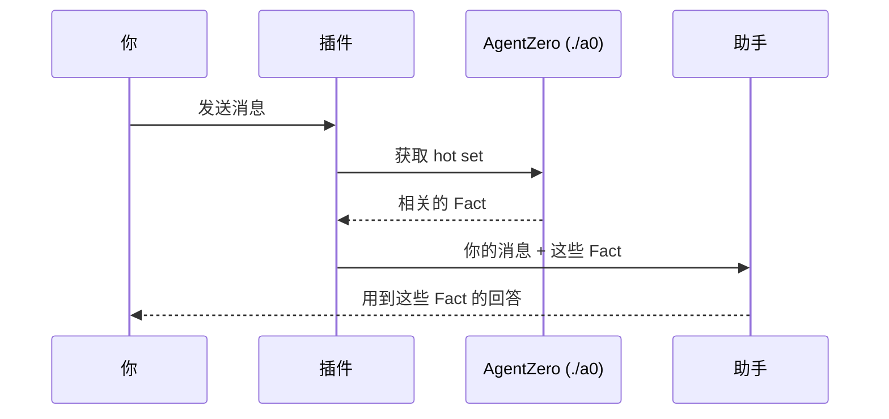
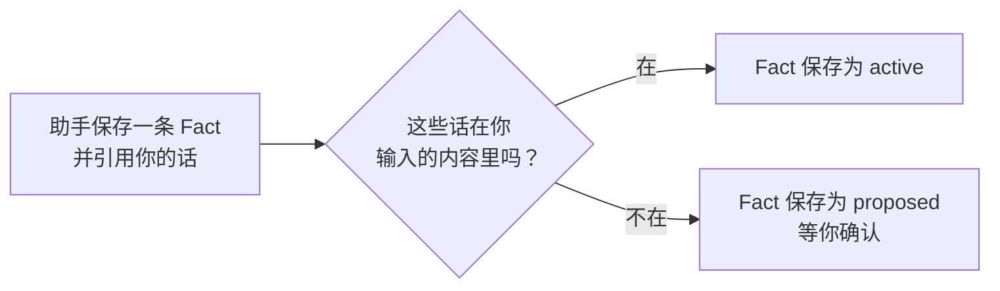

# agentzero-claude-mod

[English](./README.md) | **简体中文**

这是 Claude Code 的一个插件。它让 AI 助手记住你的项目。它还会检查这份记忆是否正确。

## 问题

Claude Code 会忘事。你开一个新对话，助手就不知道你上周说过什么。

[AgentZero](https://github.com/jesselei1102-hue/agentzero) 是一个免费工具，用来解决这个问题。它把关于你项目的短笔记存在一个文件夹里。每条笔记是一句话。我们把一条笔记叫作 **Fact**（事实）。例如：“这个项目用 pnpm，不要用 npm。”

一条 Fact 有两种状态：

| 状态 | 含义 |
|---|---|
| **active**（已生效） | 你说过。助手会使用它。 |
| **proposed**（待确认） | 助手猜的。它要等你说“是”或“不是”。 |

AgentZero 有两个薄弱点：

1. **助手必须自己加载记忆。** 对话开始时要加载。Claude Code 把长对话缩短之后，要再加载一次。助手有时会忘。
2. **助手保存 Fact 时，必须引用你的原话。** 没有东西检查这句引用。助手可以编一句。

这个插件解决这两个问题。

## 安装

你需要：

- **Claude Code**（[获取方法](https://code.claude.com/docs)）。
- **Python 3.11 或更高版本**，并装有 PyYAML 包。检查版本，运行 `python3 --version`。安装 PyYAML，运行 `python3 -m pip install pyyaml`。
- **macOS 或 Linux。** Windows 没有测试过。

步骤：

1. 在 Claude Code 里添加这个插件市场。插件市场就是一份插件列表。
   ```text
   /plugin marketplace add jesselei1102-hue/agentzero-claude-mod
   ```
2. 安装插件。Claude Code 问你范围时，选最小的（project 或 local）。这样插件只在你选的项目里工作。
   ```text
   /plugin install agentzero@agentzero
   ```
3. 在 Claude Code 里打开你的项目文件夹。在这里设置 AgentZero：
   ```text
   /agentzero init
   ```
4. **在同一个文件夹里开一个新对话。** Claude Code 只在对话开始时读取 AgentZero 的文件。
5. 检查设置，运行 `/agentzero status`。

完成。你照常工作就行。插件会自己运行。

## 插件做什么

### 1. 它替你加载记忆

**hot set** 是一份短清单，列出和你这条消息最相关的 Fact。助手回答之前必须先读 hot set。

插件加载 hot set，并把它和你的消息一起交给助手。你看不到它。插件在这些时候这样做：

- 你发出一个对话的第一条消息时；
- `/compact`（缩短对话）或 `/clear`（开始新对话）之后的第一条消息；
- 过了六小时之后的第一条消息。



“获取 hot set”这一步约需 100 毫秒。如果它失败、超过 10 秒或没有返回内容，插件就不带 hot set 发送你的消息。然后插件会说明原因，例如 `AgentZero: hot set not loaded (exit 1)`。

### 2. 它检查你的引用

助手保存一条“你说过”的 Fact 时，必须给出你的原话。AgentZero 里对应的命令是 `./a0 memory remember "这条 Fact" --said "你的原话"`。

插件会在你本次对话输入的内容里找这些话。多余的空格和换行不影响结果。



例子：

```text
你：      这个项目用 pnpm，不要用 npm。npm 会破坏我们的锁文件。

助手：    ./a0 memory remember "用 pnpm，不用 npm" --said "这个项目用 pnpm，不要用 npm。"
插件：    这些话在你的消息里。命令照常运行。Fact 是 active。
          下周开新对话，助手仍然会用 pnpm。

后来，助手读到仓库里的一份部署说明，自己定了一条规则。

助手：    ./a0 memory remember "周五不部署" --said "我们周五从不部署。"
插件：    你从没输入过这些话。插件把命令改成 "memory propose fact"。
          Fact 保存为 proposed。插件告诉助手：“去问操作者。”
          编出来的引用不会被保存。
助手：    我在部署说明里看到一条规则：周五不部署。要我保留它吗？
```

没有这个插件，第二条 Fact 会是 active。助手就会遵守一条你从没给过的规则。

AgentZero 自己也可能把 Fact 保存为 proposed。当 Fact 说的比你的原话多时，它会这样做。

要查看 proposed 的 Fact，在项目文件夹里运行 `./a0 memory review`。你可以逐条确认或拒绝。

### 3. `/agentzero` 命令

| 命令 | 作用 |
|---|---|
| `/agentzero init` | 在当前文件夹设置 AgentZero。它会拒绝你的主目录、根目录 `/`，以及已经是（或位于）AgentZero 项目里的文件夹。 |
| `/agentzero upgrade` | 把项目更新到本插件自带的 AgentZero 版本。它不会覆盖你改过的框架文件。被拦下时，它会显示原因。 |
| `/agentzero status` | 显示项目能不能运行。显示插件版本和 AgentZero 版本。 |
| `/agentzero review` | 打开待确认面板（见下文）。 |

### 4. 记忆看得见

输入框上方有一条提示条，一直显示记忆的状态：


- **提示条**显示有几条 Fact 生效、几条等你确认、hot set 上次什么时候加载、对话空间用了多少。hot set 加载失败时，那一格变红，并写明原因。
- **面板。** 有东西等你确认时，提示条上会出现 `Review` 按钮。点它，侧边打开一个面板。每一条都有两个按钮：`✓ Keep`（保留）和 `✗ Reject`（拒绝）。插件替你运行 AgentZero 自己的 `review` 命令，提示条的数字随之变化。
- 提示条、面板和卡片上的文字都是英文。
- **卡片。** 助手写入记忆时，这条命令会显示成一张卡片：用你的原话记下的 Fact 是绿色，等你确认的是黄色，助手使用技能时是蓝色。

## 限制

- **只支持 Claude Code。** Codex 和 Cursor 不使用这个插件。
- **截短的引用能通过检查。** 检查只能证明这些话是你说的，不能证明它们是你说的全部。
- **插件只读一种命令写法。** 写法是：可选的 `cd <文件夹> &&`，然后是 `./a0 memory remember ...`（或 `python -m memory remember ...`）。值必须是带引号的普通文字。它只读这几个选项：`--said`、`--fact-key`、`--scope`、`--tag`、`--source-run`。其他写法，命令照原样运行。你会看到这条消息：`the operator's words in this remember were not checked`（这条 remember 里的话没有核对）。
- **只有调用了 MCP 工具的任务，才能被发现是重复的。** **Skill** 是为一类任务保存下来的做法。**MCP 工具**是你接入 Claude Code 的服务器提供的工具。AgentZero 比较每次运行调用了哪些 MCP 工具，以此发现又出现了的任务。一个任务如果不调用 MCP 工具，比如只用文件和命令行写笔记，就永远不会被看成重复，所以 AgentZero 不会因为重复而提议做成 Skill。助手在两种情况下仍会提议做成 Skill（已测试）：你说一类任务以后每次都这样做；它写了一个脚本，把一批文件变成你要的结果。
- **桌面 app 的状态栏很小，在模型名旁边。** 所以插件的每条消息也会以短暂弹出的提示（toast）显示。
- **在桌面 app 里，卡片不一定显示。** 桌面 app 会把每次连续运行的命令折叠成一行（“Ran a command”）。技能卡片会显示；记下 Fact 的卡片常常藏在折叠里。提示条和面板显示的是同样的状态。在终端里，卡片在测试中会显示，还没有手工确认。
- **提示条、面板和卡片的颜色按浅色主题设计。**
- **还没测试：** Windows；终端和 VS Code（桌面 app 已测试）；在从没用过 AgentZero 的电脑上首次安装。
- **插件使用 Claude Code 的一个抢先体验功能（function hooks）。** 它在不同的 Claude Code 版本之间可能会变。我们在 2.1.280 版、2.1.289 版（终端）和 2.1.286 版（桌面 app）上测试过。

## 给开发者

仓库的结构：

```text
.claude-plugin/marketplace.json   插件市场（一个插件）
plugins/agentzero/
  hooks/                          插件代码（TypeScript）和它的测试
  tools/snapshot.py               把记忆状态输出成 JSON，供提示条、面板和卡片使用
  kernel/                         固定版本的 AgentZero 副本（Python）
                                  SOURCE.json：它的提交号和每个文件的哈希
scripts/sync_kernel.py            把 AgentZero 的某一个提交复制到 kernel/
tests/                            Python 测试：复制脚本，以及 kernel/ 对照 SOURCE.json
docs/                             设计（spec.md、hud-spec.md）、测试了什么（verify.md）、怎么写测试（test-kit.md）
```

插件没有重写 AgentZero。它运行 `kernel/` 里的那份副本。有一个测试会把 `kernel/` 里每个文件和它的哈希比较。所以这份副本和 AgentZero 完全一样。插件代码约 1,500 行。

在桌面 app 里试改动：先提交，再把 `plugins/agentzero/.claude-plugin/plugin.json` 里的 `version` 调高，在装了插件的项目里运行 `claude plugin update agentzero@agentzero --scope local`，然后退出并重新打开 app。桌面 app 运行的是这条更新命令复制出的副本；终端直接读文件夹。

运行测试：

```bash
claude plugin test plugins/agentzero    # 插件代码
python3 -m pytest                       # 复制脚本和 kernel/
```

使用 AgentZero 的新版本：

```bash
python3 scripts/sync_kernel.py <AgentZero 的路径> --ref <标签> --denylist <文件>
```

然后发布新的插件版本。详见 [CHANGELOG.md](./CHANGELOG.md) 和 [DECISIONS.md](./DECISIONS.md)。

## 许可证

MIT。`kernel/LICENSE` 是 AgentZero 的许可证。
